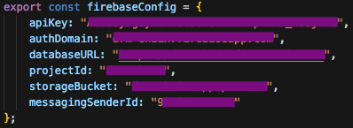

# Rights Done Right

This is the repository for a MSc project written by Andreas Fougner Engebretsen and Hallvard Kristoffer Boland Haugen at the Norwegian University of Science and Technology:

NAME OF FILE - LINK OF FILE (TBA)

Download:
### Part 1

1. `git clone repository`
2. `cd webapp`
3. `npm install`

### Part 2
You will need a working copy of [angular-cli](https://github.com/angular/angular-cli) (aka. `ng`) installed in your environment (`npm install -g @angular/cli`). And if you're new, install Ganache desktop application (http://truffleframework.com/ganache/) in order to host a local blockchain with some test accounts. Both the cli-tool and the desktop application is required before moving forward.

4. Run Ganache desktop application
4. `truffle compile` to compile your contracts
5. `truffle migrate` to deploy those contracts to the network

The next thing you will need is a way to access your running blockchain. The project is tested with an application called [MetaMask.io](https://metamask.io). This is a browser extension that connects our JavaScript code to our Solidity contracts by injecting a framework called Web3.js. Add this extension to your browser and make sure to switch the Metamask network to Localhost 8545. This is the server where the Ethereum blockchain is hosted. The application will not function properly if you are connected to a different network.

The first time you connect to the blockchain: copy the mnemonic located at the very top of Ganache application window and log in to Metamask by clicking on 'Restore from seed phrase' by pasting the mnemonic and creating a password. 

For future logins: use the password you created.

:warning: Everytime you restart Ganache and migrate the contracts to the blockchain, your Metamask account needs to reset. This is done by clicking the menu button in the top right corner :arrow_right: Setting :arrow_right: 'Reset account'. You can tell if your account has reset if prior transactions have been removed from your transaction history. :warning:

### Part 3
In order to run the application without errors you will need to configure a personal [Firebase](https://firebase.google.com) project. Follow the steps on their website. This application uses 'Authentication', 'Database' and 'Storage'. Once you have set up a project successfully, copy the configuration and place its values at the corresponding places in `app.module.ts` as such:

And then run the following while your in `/webapp`:

6. `ng serve`. Navigate to `http://localhost:4200/`. The app will automatically reload if you change any of the source files.
7. Check if there are any errors in the browser console.